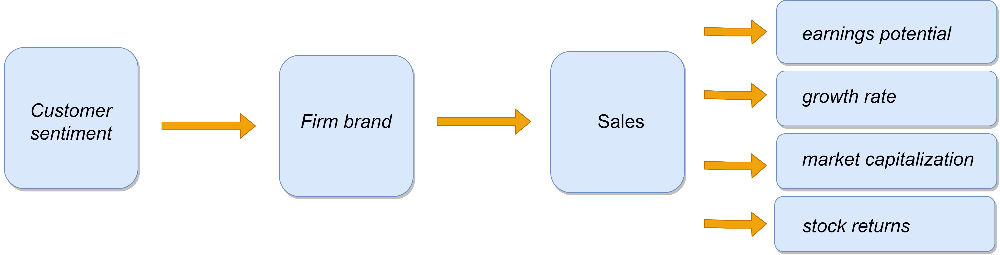

# Customer Satisfaction Measurement with N-gram and Sentiment Analysis
Python code for **Customer Satisfaction Measurement with N-gram and Sentiment Analysis**, *Towards Data Science (Medium)*, Apr 10, 2023.
Article available from [here](https://towardsdatascience.com/customer-satisfaction-measurement-with-n-gram-and-sentiment-analysis-547e291c13a6?sk=62f9decb619744c96c49735ff09653c3).

 

  

